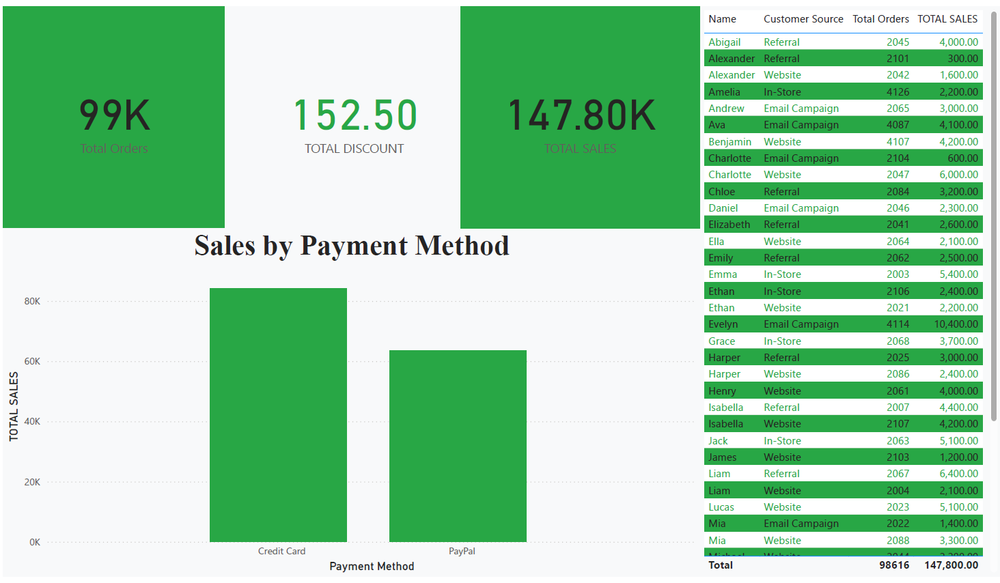

# 📊 AdventureWorks Sales Dashboard
## 🖼️ Dashboard Preview

## 🧭 Project Overview
This project analyzes **AdventureWorks sales data** to gain insights into sales performance, customer behavior, and payment preferences.  
The interactive dashboard was designed using **Power BI** to visualize key performance indicators (KPIs) in a clear and engaging way.

---

## 🎯 Objectives
- Understand total sales performance.  
- Compare sales by payment method.  
- Identify top-performing customer sources.  
- Highlight insights to improve marketing and sales strategies.

---

## 📈 Key Performance Indicators (KPIs)
| Metric | Value |
|---------|--------|
| **Total Orders** | 99K |
| **Total Sales** | 147.8K |
| **Total Discount** | 152.50 |

---

## 💳 Sales by Payment Method
The dashboard compares two main payment methods:

- **Credit Card:** Generated higher sales exceeding **80K**.  
- **PayPal:** Came second with around **60K** in sales.  

👉 This indicates that **customers prefer credit card payments** over PayPal.

---

## 🧍 Customer Analysis
Customers were segmented by **Customer Source**: Referral, Website, In-Store, and Email Campaign.

- Highest sales came from **Email Campaign** and **In-Store** customers.  
- This highlights the success of **email marketing** and **direct sales** strategies.  
- Example: *Customer Evelyn (Email Campaign)* achieved **10.4K** in sales — the highest individual total.

---

## 🪄 Summary of Insights
- Total sales reached **~148K**, showing strong performance.  
- **Credit Cards** dominate as the main payment method.  
- **Email campaigns** are highly effective in generating high-value customers.

---

## 🛠️ Tools Used
- **Power BI Desktop** — Data analysis and dashboard creation.  
- **AdventureWorks Dataset** — Data source for analysis.

---

## 📂 Project Files on GitHub
| File | Description |
|------|--------------|
| `AdventureWorksSales.pbix` | Power BI report file |
| `Dashboard.png` | Screenshot of the dashboard |
| `AdventureWorks_Sales_Report.pdf` | PDF version of the report |
| `README.md` | Project documentation |

---

## 🧠 Author
**Leena Bakri **  
Data Analyst passionate about sustainable development, data visualization, and business intelligence.

---
